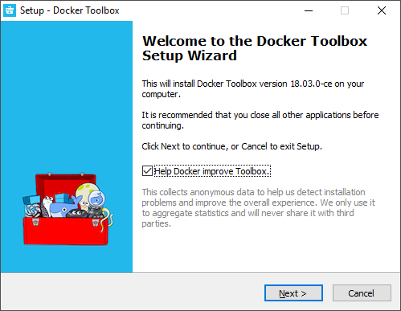
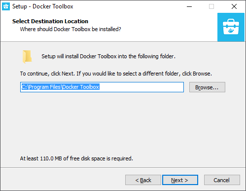
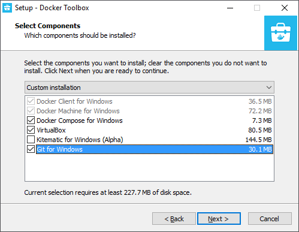
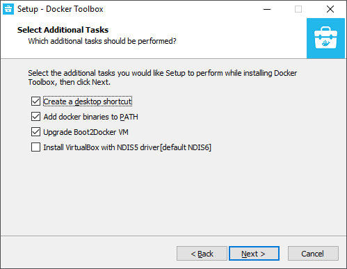
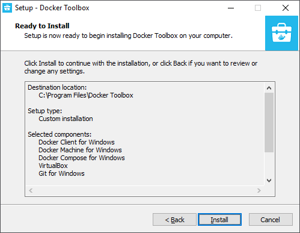
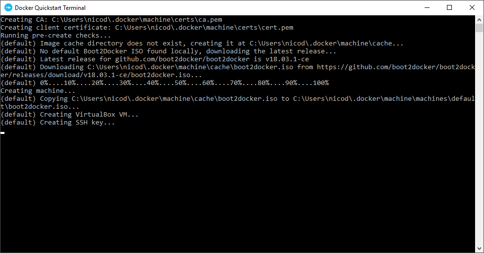
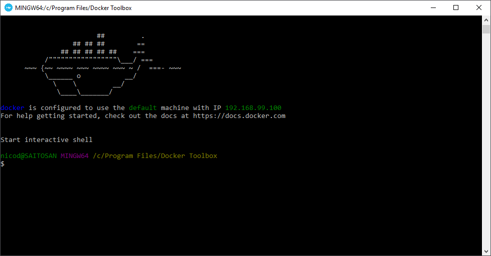

# Installation

## Installing Docker on Raspberry Pi

Start by updating the apt repository and installing the latest packages:

```shell
sudo apt update && sudo apt upgrade
```

Fetch a nice docker installation script and execute it

```shell
curl -sSL https://get.docker.com | sh
```

The script will run with root privileges and will therefore request your password.

To allow the `pi` user (or your own user) to run docker commands, you will need to add the user to the `docker` group:

```shell
sudo adduser pi docker
```

Reboot your Raspberry Pi for all changes to take effect.

### Verifying the Installation

The docker installation can be easily verified by requesting the current installed version:

```shell
docker --version
```

## Installing Docker on Windows

Docker uses Linux-specific kernel features and therefore does not run natively on Windows. Docker Toolbox solves this by providing a command line interface to the docker engine running on a virtual machine equipped with a Linux kernel.

To use docker on Windows, download the Docker Toolbox at [https://docs.docker.com/toolbox/toolbox\_install\_windows/](https://docs.docker.com/toolbox/toolbox_install_windows/)

### Steps to take





Make sure to select all components, only "Kitematic" is not required (GUI) in this course, but may be installed to manage containers more easily.

> **INFO** - **GIT**
>
> If you already have GIT (a code version control system) installed you can also leave this unchecked.



Next make sure to add docker binaries to your environment path!



Ready for installation



### Launching the CLI

To start using the Docker Toolbox find the "**Docker QuickStart Terminal**" and launch it.

The first time you run the terminal app it will setup a virtual machine and do some configurations.



Shortly after the CLI should become available.



You are now ready to start using Docker.