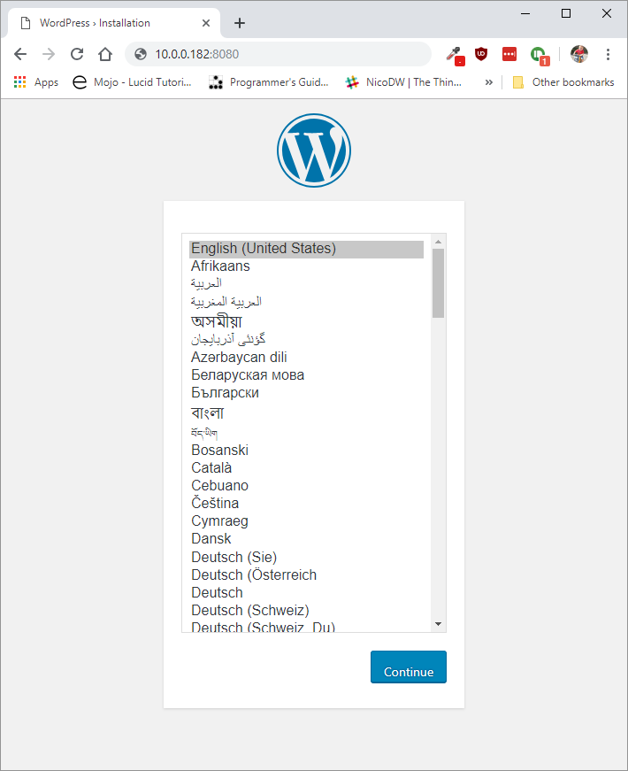

# Chapter 04 - Running Containers

Running images with Docker can be done using the `docker run` command. The command can take many attributes that supply information on how to run the container. It also allow you to override all defaults set by the image developer, as well as those set by the docker runtime.

To run the well-known `hello-world` image, we can use the following command.

```bash
docker run hello-world:latest
```

Here `hello-world` is the name of the image and `latest` is the version tag, which allows you to pick a specific version to run a container from.

This will pull the latest image from Docker Hub and spawn a container from it. The container will execute the binary which generates the output. This output is then redirected via the Docker client to your current terminal.

> **INFO** - **Docker Hub**
>
> Sharing Docker images is made easy by Docker Hub. Anybody can create an account on Docker Hub to distribute images that can be deployed on other systems or by other users. Therefore it will always be the first place we'll check if someone did not do most of the work for us.

## Setting Up a WordPress

WordPress is a free and open-source content management system based on PHP & MySQL. It includes a plugin architecture and a template system. It is most associated with blogging but supports other types of web content including more traditional mailing lists and forums, media galleries, and online stores.

To setup a WordPress, two things are required:

* A database to store all the information (users, pages, configuration, ...)
* The WordPress application itself

Searching on DockerHub for `WordPress` and `MariaDB` (MySQL drop-in alternative) will result in two useful links:

* [https://hub.docker.com/r/arm64v8/mariadb/](https://hub.docker.com/r/arm64v8/mariadb/)
* [https://hub.docker.com/_/wordpress](https://hub.docker.com/_/wordpress)

> **WARNING** - **ARM Image MariaDB RPi2**
>
> While an image of MariaDB is available for ARM, it is not compatible with the Raspberry Pi 2 ARMv7. No problem exists for the Raspberry Pi 3, as the RPi3 has a v8 64-bit architecture. For the Raspberry Pi 2, an unofficial image will need to be used [https://hub.docker.com/r/jsurf/rpi-mariadb/](https://hub.docker.com/r/jsurf/rpi-mariadb/).

Both docker images are well-maintained, used a lot and available for the ARM architecture.

### Creating a user-defined network

In terms of Docker, a bridge network uses a software bridge which allows containers connected to the same bridge network to communicate, while providing isolation from containers which are not connected to that bridge network. The Docker bridge driver automatically installs rules in the host machine so that containers on different bridge networks cannot communicate directly with each other.

Advantages compared to the default bridge:

* User-defined bridges provide better isolation and interoperability between containerized applications.
* User-defined bridges provide automatic DNS resolution between containers.
* Containers can be attached and detached from user-defined networks on the fly.
* Each user-defined network creates a configurable bridge.
* Only linked containers on the default bridge network share environment variables.

To create a user-defined network execute the command below. Make sure to pick a unique name for the network that identifies the actual setup.

```shell
docker network create --name wordpress-network
```

Checkout the results using `docker network ls`.

### Starting a MariaDB container

To start the database container, the following command can be executed:

```shell
docker run --name <container_name> -e MYSQL_ROOT_PASSWORD=<super_secret_password> -d --net=<network> mariadb:latest
```

<!-- The above command should automatically pull the image from the arm64v8 organization. Test it in the classroom. -->

This instructs docker to create a new container and give it a more recognizable name (instead of the auto-generated ones). It also configures the database password by supplying an environment variable using the `-e` option. The `-d` option instructs docker to run the container in a detached state - in the background in other words. Output from the container is not shown in the current terminal but can only be accessed by using the `docker logs` command.

> **WARNING** - **Detached State**
>
> Do note that the detached state is especially useful when running daemonized processes inside the container. Running the hello-world image in a detached state will not have a lot of meaning. The output is not shown and the container is automatically exitted after finishing the process. You can try it by executing `docker run -d hello-world`. The only output that is shown in the container id. You can however check out the output by invoking the `docker logs <container_id>` command.

So let's fill in the necessary information and run the container:

```shell
docker run --name wordpress-db -e MYSQL_ROOT_PASSWORD=hu5h43534h4334573 -d --net=wordpress-network mariadb:latest
```

Executing a `docker ps` should show the container as up and running:

```shell
CONTAINER ID        IMAGE           COMMAND                  CREATED             STATUS              PORTS               NAMES
50b2754a5dfc        mariadb:latest  "docker-entrypoint.s…"   About an hour ago   Up About an hour    3306/tcp            wordpress-db
```

When inspecting the `wordpress-network` using `docker network inspect wordpress-network`, you should see that the `wordpress-db` container is connected:

```shell
[
  {
    "Name": "wordpress-network",
    ...
    "Containers": {
      "d27f551b6c815bce501db8525f4bca1701d89bf8281a145442841cb2746ee79f": {
          "Name": "wordpress-db",
          "EndpointID": "a8a68edbb1c99233f2fe1a1d8bfa60bc0bd14d0966573b4640804dca962f3a05",
          "MacAddress": "02:42:ac:12:00:02",
          "IPv4Address": "172.18.0.2/16",
          "IPv6Address": ""
      }
    }
    ...
  }
]
```

### Starting WordPress

Once the database is up and running, the WordPress application container can be started. For this we'll need to supply the name of the container running the database, `wordpress-db` in our case and the root password.

```shell
docker run --name my-wordpress -e WORDPRESS_DB_HOST=wordpress-db -e WORDPRESS_DB_PASSWORD=hu5h43534h4334573 -p 8080:80 -d --net=wordpress-network wordpress
```

We also need to open the port on which the WordPress is listening to the outside, so we can connect to it from outside the docker environment. For this we map the port of the internal process `80` to a port on our Raspberry Pi host, namely `8080`.

> **WARNING** - **Link**
>
> The WordPress setup instructions on Docker Hub instruct you to use the `link` option to link both containers using the command `docker run --name some-wordpress --link some-mysql:mysql -d wordpress` However this option is becoming depricated in favor of user-defined networks and docker-compose setups.

### Surfing to the WordPress site

When you traverse to the WordPress website at port `8080` on the IP address of your Raspberry Pi, you should get the installer screen.



Finish the setup wizard and enjoy your website.